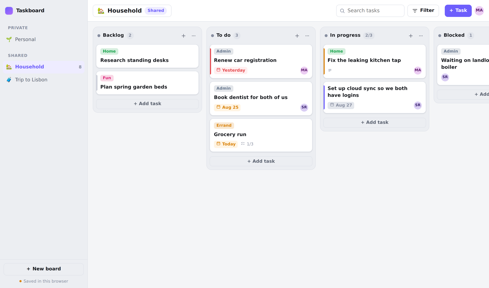
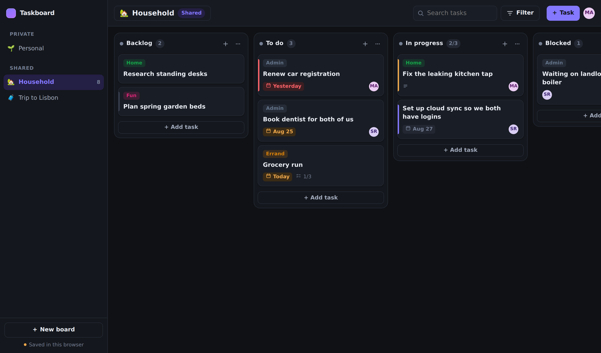
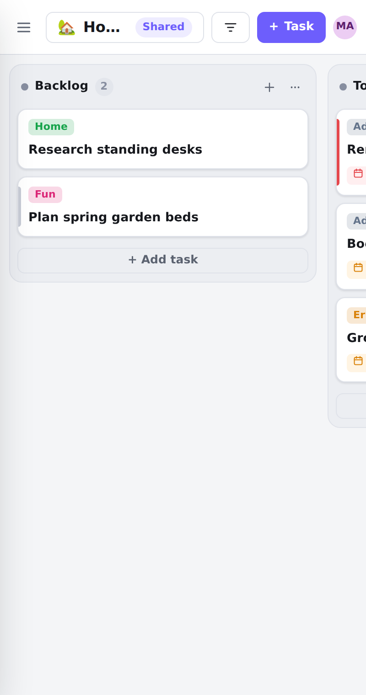

# Taskboard

A self-hosted kanban board for a household — shared boards you both see, private boards only you see, and drag and drop that works with a mouse, a finger, or the keyboard. It is a static site: no server to run, no build step, no dependencies to install. Drop it on GitHub Pages and it works.



<details>
<summary>Dark mode &amp; mobile</summary>




</details>

---

## What it does

**Signing in**
- **Continue with Google** in both modes — same button, same account, whichever backend you run
- In cloud mode that account is your identity everywhere: sign in on your laptop, phone and tablet and you get the same boards, syncing live
- Invite people who have not signed up yet — the board is waiting for them when they first sign in
- In local mode it keeps two people's boards apart on a shared computer (the data still never leaves that browser)

**Boards**
- Private boards (just you) and shared boards (you + whoever you invite), split into two groups in the sidebar
- Per-board columns you can rename, reorder, delete, or mark as the "done" column
- Per-board labels with colours
- Emoji + name per board, deep-linkable at `#/b/<boardId>`

**Cards**
- Title, notes, assignee, due date, priority, labels, and a checklist with a progress bar
- Due dates turn amber as they approach and red once overdue
- Everything in the task dialog auto-saves — there is no Save button to forget
- Inline composer: click *+ Add task*, type, press Enter, keep typing for the next one

**Kanban discipline**
- **WIP limits** per column. The column header shows `3/3`, and going over turns the column red with a nudge to finish something before starting more. This is the one rule that makes a kanban board more than a to-do list — limiting work in progress is what surfaces bottlenecks and stops half-finished work piling up. ([Asana's kanban guide](https://asana.com/resources/what-is-kanban), [IxDF on kanban boards](https://ixdf.org/literature/topics/kanban-boards))
- A "done" column marks its cards as complete, and *Hide tasks in done columns* keeps the board about what's live

**Finding things**
- Instant search across titles and notes
- Filters for assignee (including *Me* and *Unassigned*), due window (overdue / today / next 7 days / no date), priority, and label — with a count badge so you never forget a filter is on

**Moving cards — three ways**
1. **Drag** with a mouse: pick up a card, columns open a gap where it will land, and the board auto-scrolls when you drag near an edge. Column headers drag too, to reorder columns.
2. **Touch**: press and hold a card for a moment, then drag. A short hold keeps ordinary finger-scrolling working.
3. **Keyboard**: Tab to a card, press <kbd>Space</kbd> to pick it up, move with the arrow keys, <kbd>Space</kbd> again to drop. Every move is announced to screen readers. There is also a *Move to →* menu on each card and a Column dropdown in the task dialog.

That third path isn't decoration: WCAG 2.2 asks that anything you can do by dragging also be doable with a single pointer or the keyboard ([SC 2.5.7 Dragging Movements](https://www.w3.org/WAI/WCAG22/Understanding/dragging-movements.html)).

**Other niceties** — light/dark/system themes, seven accent palettes (avatar menu → Accent), works on phones, installable as a PWA, `?` opens the shortcut sheet.

Every accent ships a light tone and a dark tone rather than one colour dimmed for both, and each pair is picked to clear 4.5:1 for label text on the accent and for accent-coloured text on its own tint, in both themes.

---

## Quick start (2 minutes, local mode)

```bash
git clone https://github.com/marclundgren/taskboard.git
cd taskboard
python3 -m http.server 8000     # or: npx http-server -p 8000
```

Open <http://localhost:8000>, click **Continue on this device**, and you have a board. In **local mode** everything lives in this browser's `localStorage` — no account, no network. Great for trying it out; not shareable, and it does not follow you to your phone.

Want the Google button here too? See [Google sign-in in local mode](#google-sign-in-in-local-mode). To share boards with your partner, set up **cloud mode** below.

## Publishing to GitHub Pages

The repo *is* the site — there is nothing to build.

1. Push this repository to GitHub with the site files at the root of `main`.
2. **Settings → Pages → Build and deployment → Source: Deploy from a branch**, then pick `main` and `/ (root)`.
3. Give it a minute; your board is at `https://<you>.github.io/taskboard/`.

`.nojekyll` is included so GitHub serves every file as-is.

> **Note:** a GitHub Pages site is public — anyone with the URL loads the app. That is fine, because the *app* is public but your *data* is not: in local mode the data never leaves your browser, and in cloud mode it lives in your Firebase project behind sign-in and the rules in `firestore.rules`. Never put anything secret in this repo.

---

## How sign-in works

Both modes show the same **Continue with Google** button, but they mean different things — worth knowing which you're relying on.

| | Local mode | Cloud mode |
| --- | --- | --- |
| Who identifies you | Google Identity Services, in the browser | Firebase Auth |
| Where boards live | this browser's `localStorage` | your Firestore database |
| Same boards on another device | **no** | **yes** — sign in and they're there |
| Two people, one computer | separate boards, side by side | separate accounts |
| Is it a security boundary | **no** — see below | yes, enforced by `firestore.rules` |

**Multi-device is a cloud-mode feature, and it needs no matching logic.** Your Google account has a stable id, and every board and card keys off that id rather than a name — `memberIds`, `assigneeId`, everything. Sign in with the same account anywhere and the same boards appear. Your partner signs in with theirs, gets a different id, and sees only the boards they're a member of. Neither of you has to be named anything in particular.

**Local-mode sign-in is organisational, not protective.** The ID token is decoded in the browser for your name and picture, but it cannot be *verified* without a server, and the boards sit in `localStorage` where anyone with dev tools on that machine can read them. It stops your partner from opening your laptop and landing in your private boards; it is not a lock. If you want a real boundary, that's cloud mode.

### Google sign-in in local mode

Optional — skip it and local mode uses a single "continue on this device" profile.

1. In the [Google Cloud console → Credentials](https://console.cloud.google.com/apis/credentials), **Create credentials → OAuth client ID → Web application**.
2. Under **Authorized JavaScript origins** add every origin you'll open the site from, e.g. `https://marclundgren.github.io` and `http://localhost:8000`.
3. Put the client id in `config.js`:

```js
google: {
  clientId: '1234567890-abc.apps.googleusercontent.com',
},
```

In cloud mode this setting is ignored — Firebase brings its own Google client.

## Cloud mode setup (about 5 minutes)

Cloud mode gives you what a static site can't do alone: separate logins for you and your partner, boards shared between you, and realtime sync across devices. It uses Firebase — the free Spark tier is far more than a couple's task board will ever need.

**1. Create the project**

- Go to <https://console.firebase.google.com>, **Add project** (Google Analytics: not needed).
- **Build → Authentication → Get started → Sign-in method → Google → Enable**. Pick a support email, save.
  (Want GitHub sign-in too? Enable the GitHub provider and add `'github'` to `authProviders` in `config.js`.)
- **Build → Firestore Database → Create database → Start in production mode**, pick a region near you.

**2. Register the web app**

- **Project settings (⚙) → Your apps → Web (`</>`)**, give it a nickname, register.
- Copy the `firebaseConfig` values it shows you.

**3. Paste them into `config.js`**

```js
firebase: {
  apiKey: 'AIza…',
  authDomain: 'your-project.firebaseapp.com',
  projectId: 'your-project',
  appId: '1:1234567890:web:abcdef',
},
```

These are not secrets — Firebase web config is public by design, and access is enforced by the security rules, not by hiding the keys.

**4. Deploy the security rules** — this is the step that actually protects your data.

Paste the contents of [`firestore.rules`](firestore.rules) into **Firestore → Rules → Publish**, or with the CLI:

```bash
npm i -g firebase-tools
firebase login
firebase use --add        # pick your project
firebase deploy --only firestore:rules
```

**5. Authorise your domain**

**Authentication → Settings → Authorized domains → Add domain** → `<you>.github.io`. (`localhost` is allowed out of the box.)

**6. Invite your partner**

Commit and push, open the Pages URL, sign in with Google. Then open a board → **Share** → type their email → **Add**.

They do not need an account yet. If they already have one they join immediately; if not, the address is parked on the board and the board is waiting for them the first time they sign in with that address. Either way the board moves to *Shared* and edits appear on each other's screens live.

Taskboard cannot send the invitation email itself — a static site has no server and no mail credentials. **Write the email** in the Share dialog opens your own mail app with the link and instructions filled in, and **Copy link** gives you something to paste into a message. If you would rather it sent automatically, install the [Trigger Email from Firestore](https://extensions.dev/extensions/firebase/firestore-send-email) extension (needs the pay-as-you-go Blaze plan and an SMTP account) and write invitations to its `mail` collection.

### How access works

One idea, applied everywhere: a board is visible to exactly the user IDs listed in its `memberIds`. A private board is one where that list is just you.

| Path | Who can read | Who can write |
| --- | --- | --- |
| `boards/{id}` | members, plus anyone holding a pending invitation to it | members (the owner can't be changed; only the owner can delete) |
| `boards/{id}/tasks/{id}` | members | members |
| `users/{uid}` | any signed-in user | only that user |
| `emailIndex/{email}` | any signed-in user | only the owner of that email |

An invitee's one permitted write is swapping their pending invitation for membership — they cannot change anything else on the board until they are a member, and cards stay unreadable until then.

`emailIndex` is what makes "invite by email" work without a server: each person claims their own email → uid mapping when they sign in. It means a signed-in user can check whether an email has an account here — the tradeoff for serverless invites on a board you host yourself.

Everyone on a shared board is an equal editor, including inviting and removing others. For a household board that's the point; if you ever want owner-only invites, tighten the `update` rule in `firestore.rules`.

---

## Keyboard shortcuts

| Key | Action |
| --- | --- |
| <kbd>N</kbd> | New task in the first column |
| <kbd>B</kbd> | New board |
| <kbd>/</kbd> | Focus search |
| <kbd>Tab</kbd> | Move between cards |
| <kbd>Space</kbd> | Pick up / drop the focused card |
| <kbd>←</kbd> <kbd>→</kbd> | Move a picked-up card between columns |
| <kbd>↑</kbd> <kbd>↓</kbd> | Move a picked-up card within its column |
| <kbd>Enter</kbd> | Open the focused card |
| <kbd>Esc</kbd> | Close a dialog, cancel a move, clear search |
| <kbd>?</kbd> | Shortcut sheet |

---

## Tests

`tests/e2e` runs the real app against the Firebase emulators in two isolated
browser profiles and proves a task created in one is stored server-side and
visible in the other — including live sync and offline queueing. See
[tests/e2e/README.md](tests/e2e/README.md).

Append `?mode=local` to any URL to force the localStorage backend without
touching `config.js`.

## How it's built

Plain ES modules, no framework, no bundler — so what you push is exactly what runs, and it will still run in five years.

```
index.html               app shell
config.js                your settings (Firebase config goes here)
firestore.rules          who can read and write what
assets/css/styles.css    design tokens + all styling, light and dark
assets/js/
  app.js                 state, actions, routing, keyboard, wiring
  dnd.js                 pointer-driven drag and drop (mouse, touch, pen)
  util.js                dates, ordering maths, small helpers
  data/
    index.js             picks the backend from config.js
    local.js             localStorage backend
    firebase.js          Firestore + Auth backend
    google-identity.js   the Google sign-in button used by local mode
    model.js             board/task shapes
  ui/
    board.js             columns, cards, composer, keyboard moving
    task-modal.js        the task dialog
    dialogs.js           new board, settings, share, filters, shortcuts
    sidebar.js  menu.js  modal.js  toast.js  common.js  icons.js
```

**Both backends implement the same interface**, so the UI never knows which one it is talking to. Adding a third (Supabase, a CouchDB, your own API) means writing one more file in `data/`.

**Card ordering** uses a numeric `order` field. Dropping a card between two others gives it the midpoint of their two orders, so a move writes exactly one document instead of renumbering the column. When midpoints run out of precision the column is renumbered once in a batch.

**Data model**

```
boards/{boardId}
  name, emoji, ownerId, memberIds[], pendingEmails[], visibility,
  columns[], labels[], timestamps
boards/{boardId}/tasks/{taskId}
  title, notes, columnId, order, priority, labels[], dueDate,
  assigneeId, checklist[], done, timestamps
users/{uid}            displayName, email, photoURL
emailIndex/{email}     uid
```

In local mode the same shapes are stored in `localStorage`, namespaced per account: `taskboard:v1:u:<uid>:boards` and `taskboard:v1:u:<uid>:tasks:<boardId>`.

---

## FAQ

**Can I use it offline?** Local mode is entirely offline. Cloud mode keeps working while the connection drops and syncs when it returns (Firestore queues writes locally); a hard reload while offline needs the page cached by the browser.

**Can I use the same account on my phone and my laptop?** In cloud mode, yes — that's what it's for. Sign in with the same Google account on each device and you get the same boards, updating live. In local mode, no: the data physically lives in one browser, so two devices are two separate sets of boards no matter who signs in.

**How do I move my local boards into cloud mode?** In DevTools, copy your `taskboard:v1:u:<uid>:*` values before you switch, then re-create the boards. There's no importer yet — for a handful of boards, retyping is usually faster than writing one.

**Is my data private?** In local mode it never leaves your machine. In cloud mode it sits in your own Firebase project, readable only by the members of each board. Nothing is sent anywhere else — there is no analytics, no tracking, no third-party script beyond the Firebase SDK.

**What does it cost?** Nothing. GitHub Pages is free, and Firebase's free tier allows 50k document reads a day — a busy household board uses a rounding error of that.

**Can I self-host somewhere else?** Any static host works: Netlify, Cloudflare Pages, an nginx directory, a Raspberry Pi. Copy the files, done.

## License

MIT — see [LICENSE](LICENSE).
